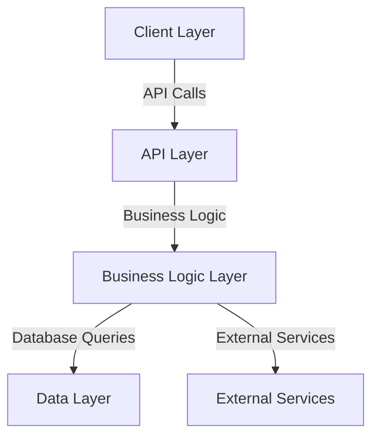

# System Architecture Overview

This document provides a comprehensive overview of the system architecture for the NaijaConnect application. The architecture is organized into several layers, each playing a crucial role in the application's functionality and performance.

## Architecture Layers

### Client Layer
- **Description:** This layer is responsible for the user interface and user interaction. It includes web and mobile client applications that communicate with the API.

### API Layer
- **Description:** The API layer acts as the intermediary between the client and the business logic layer. It handles incoming requests, processes them, and returns responses to the clients.

### Business Logic Layer
- **Description:** This layer contains the core business logic of the application. It processes data received from the API and interacts with the data layer for persistent storage.

### Data Layer
- **Description:** The data layer is responsible for data storage and retrieval. It interacts with the database to perform CRUD operations as requested by the business logic layer.

### External Services
- **Description:** This component includes all third-party services the application interacts with. This may include payment gateways, authentication services, and external APIs for data enrichment.

## Conclusion
This architecture is designed to ensure modularity and scalability, allowing for easy maintenance and upgrades as needed.